# Student Registration System

### ITST 302 – Client-Server Technologies | Week 4 Laboratory Activity

---

## 1. Introduction

### Purpose of a Student Registration System

The Student Registration System is a Laravel web application that allows students to submit their personal and academic information through an online registration form. The system collects information such as Student ID, name, email address, mobile number, date of birth, gender, program, year level, address, and profile picture.

The submitted information is validated and stored in a MySQL database. After successful registration, the system displays the student's information and uploaded profile picture.

### Importance of Data Validation

Data validation is important because it prevents incorrect or incomplete information from being saved in the database. For example, the system checks that required fields are filled in, email addresses have a valid format, Student IDs and email addresses are unique, and profile pictures are valid image files.

Laravel performs server-side validation before the information is saved. This helps protect the database and keeps the stored student information organized and reliable.

### Role of Registration Systems in Enterprise Applications

Registration systems are commonly used in schools, companies, hospitals, banks, and other organizations. They provide a way to collect important information from users and store it in a structured database.

In a school environment, student registration information can be used by other systems such as enrollment, grading, library, and student records systems. Because of this, the information collected during registration must be accurate and properly stored.

---

## 2. Objectives

The main objectives completed in this activity were:

- Create a student registration form using Laravel Blade.
- Process form submissions using a Laravel controller.
- Implement server-side validation.
- Display validation error messages.
- Display a success flash message after registration.
- Upload and store student profile pictures.
- Store student information in a MySQL database.
- Display registered student information.
- Use Laravel migrations to create the students table.
- Understand the Laravel request lifecycle.
- Practice Git and GitHub version control.
- Create technical documentation using Markdown.

---

## 3. Features

The Student Registration System includes the following features:

- Student registration form
- Server-side form validation
- Unique Student ID validation
- Unique email validation
- Mobile number validation
- Date of birth validation
- Gender selection
- Program selection
- Year level selection
- Profile picture upload
- Image file validation
- File size restriction
- Flash success messages
- Validation error messages
- Student profile page
- MySQL database integration
- Laravel Storage integration
- Responsive user interface

---

## 4. Technologies Used

| Technology | Purpose |
|---|---|
| Laravel | Web application framework |
| PHP | Server-side programming language |
| MySQL | Database management system |
| Blade | Laravel templating engine |
| CSS | User interface styling |
| Eloquent ORM | Database interaction |
| Laravel Storage | File storage |
| Git | Version control |
| GitHub | Source code repository |
| VS Code | Code editor |

---

## 5. Laravel Request Lifecycle

When a student submits the registration form, the request passes through several parts of the Laravel application.

```text
┌──────────────────────────────┐
│           Browser            │
│  Student fills out the form  │
└──────────────┬───────────────┘
               │
               ▼
┌──────────────────────────────┐
│        Route (web.php)       │
│       POST /students         │
└──────────────┬───────────────┘
               │
               ▼
┌──────────────────────────────┐
│      StudentController       │
│            store()           │
└──────────────┬───────────────┘
               │
               ▼
┌──────────────────────────────┐
│          Validation          │
│     Check submitted data     │
└──────────────┬───────────────┘
               │
        ┌──────┴──────┐
        │             │
      Valid          Invalid
        │             │
        ▼             ▼
┌──────────────┐  ┌─────────────────┐
│ Upload Image │  │ Return to Form  │
└──────┬───────┘  │ + Error Messages│
       │          └─────────────────┘
       ▼
┌──────────────┐
│ Student Model│
└──────┬───────┘
       │
       ▼
┌──────────────────┐
│  MySQL Database  │
│     students     │
└──────┬───────────┘
       │
       ▼
┌──────────────────────────────┐
│       Student Profile        │
│  Display saved information   │
└──────────────────────────────┘
```

The browser sends the form data to the Laravel route. The route sends the request to `StudentController@store`. The controller validates the information before saving it.

If validation fails, Laravel returns the user to the registration form and displays the error messages.

If validation succeeds, the profile picture is stored using Laravel Storage and the student information is saved using the Student model and Eloquent ORM. The user is then redirected to the student profile page.

The graphical version of this diagram is available in:

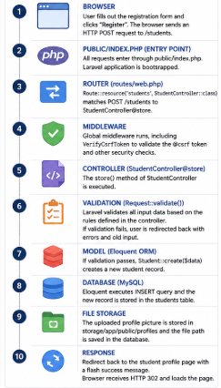

---

## 6. Validation Rules

The registration form uses server-side validation to make sure that submitted information is correct.

| Field | Validation | Purpose |
|---|---|---|
| Student ID | Required, Unique | Prevents duplicate student records |
| First Name | Required, String, Maximum 100 characters | Makes sure a valid first name is entered |
| Middle Name | Optional | Allows students without a middle name |
| Last Name | Required, String, Maximum 100 characters | Makes sure a last name is provided |
| Email | Required, Valid Email, Unique | Prevents duplicate and invalid email addresses |
| Mobile Number | Required, Numeric | Makes sure a mobile number is provided |
| Date of Birth | Required, Date | Makes sure a valid date is entered |
| Gender | Required | Makes sure a gender is selected |
| Program | Required | Makes sure an academic program is selected |
| Year Level | Required | Makes sure a year level is selected |
| Address | Required | Makes sure an address is provided |
| Profile Picture | Required, Image, JPG/JPEG/PNG, Maximum 2 MB | Protects the system from invalid or very large files |

### Why Each Validation Rule Matters

- Required fields prevent incomplete student records.
- Unique validation prevents two students from having the same Student ID or email address.
- Email validation checks whether the submitted value follows a valid email format.
- Numeric validation prevents invalid characters from being entered in fields that require numbers.
- Date validation makes sure that the date of birth is a valid date.
- Image validation makes sure that the uploaded file is an image and only allows the required image formats.
- File size validation limits profile pictures to 2 MB. This helps prevent very large files from using too much storage.

---

## 7. Database Design

### Entity Relationship Diagram

The system uses a `students` table to store registered student information.

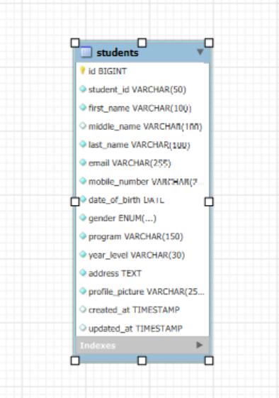

### Students Table Structure

| Column | Data Type | Description |
|---|---|---|
| id | BIGINT UNSIGNED | Primary key |
| student_id | VARCHAR(50) | Unique student ID |
| first_name | VARCHAR(100) | Student first name |
| middle_name | VARCHAR(100) | Optional middle name |
| last_name | VARCHAR(100) | Student last name |
| email | VARCHAR(255) | Unique email address |
| mobile_number | VARCHAR(20) | Student mobile number |
| date_of_birth | DATE | Student date of birth |
| gender | ENUM | Student gender |
| program | VARCHAR(150) | Academic program |
| year_level | VARCHAR(30) | Student year level |
| address | TEXT | Student address |
| profile_picture | VARCHAR(255) | Stored image path |
| created_at | TIMESTAMP | Record creation time |
| updated_at | TIMESTAMP | Record update time |

### Primary Key

The `id` column is the primary key of the table. It is automatically generated for each student record.

### Unique Constraints

The `student_id` and `email` fields are unique. This prevents duplicate Student IDs and email addresses from being stored.

### Middle Name

The `middle_name` field is optional because some students may not have a middle name.

### Profile Picture

The database does not store the actual image file. Instead, it stores the path of the uploaded image.

Example:

```
profiles/student-photo.jpg
```

The actual image is stored using Laravel Storage.

---

## 8. Registration Flowchart

The registration process follows these steps:

```text
       User Opens Registration Page
                    │
                    ▼
             Fill Out Form
                    │
                    ▼
        Submit Registration Form
                    │
                    ▼
           Laravel Validation
                    │
              ┌─────┴─────┐
              │           │
            Valid       Invalid
              │           │
              ▼           ▼
       Upload Profile    Display
          Picture        Errors
              │           │
              ▼           │
       Save Student       │
       to Database        │
              │           │
              ▼           │
       Success Message    │
              │           │
              └─────┬─────┘
                    │
                    ▼
          Student Profile Page
```

The graphical version of the registration flowchart is available in:

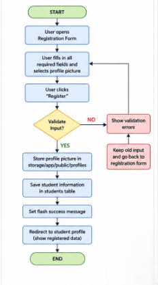

---

## 9. File Upload

The system allows users to upload a student profile picture.

Laravel Storage is used to handle the uploaded image.

The storage link was created using:

```bash
php artisan storage:link
```

The uploaded images are stored inside:

```
storage/app/public/profiles/
```

The database only stores the path of the uploaded file.

Example:

```
profiles/student-photo.jpg
```

This path is then used to display the uploaded image on the student profile page.

---

## 10. Flash Messages

After a successful registration, the system displays a success message to inform the user that the registration was completed.

Example:

```
Student registered successfully!
```

The system also displays validation error messages when the submitted information does not follow the required rules.

These messages provide clear feedback to the user and make the registration process easier to understand.

---

## 11. Screenshots

The project includes screenshots showing the main parts of the system.

| Screenshot | Description |
|---|---|
| 01-registration-form.png | Registration form with the required student fields |
| 02-validation-errors.png | Validation errors after submitting incomplete or invalid information |
| 03-successful-registration.png | Successful student registration |
| 04-flash-message.png | Success flash message displayed to the user |
| 05-profile-picture.png | Uploaded student profile picture |
| 06-database-table.png | Student record stored in the MySQL database |
| 07-student-profile-page.png | Student profile showing the registered information |
| 08-vscode-project-structure.png | Laravel project structure in VS Code |
| 09-github-repository.png | Public GitHub repository |
| 10-terminal-output.png | Laravel commands and terminal output |
| 11-browser-output.png | Working Laravel application in the browser |

### Registration Form

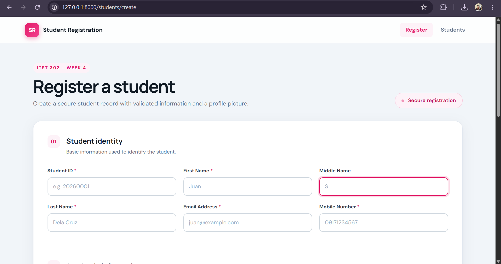

### Validation Errors

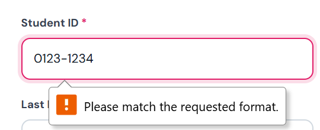

### Successful Registration

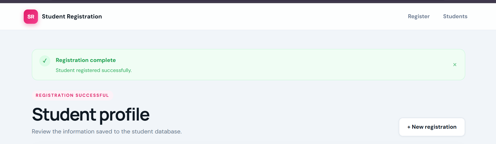

### Flash Success Message


### Uploaded Profile Picture

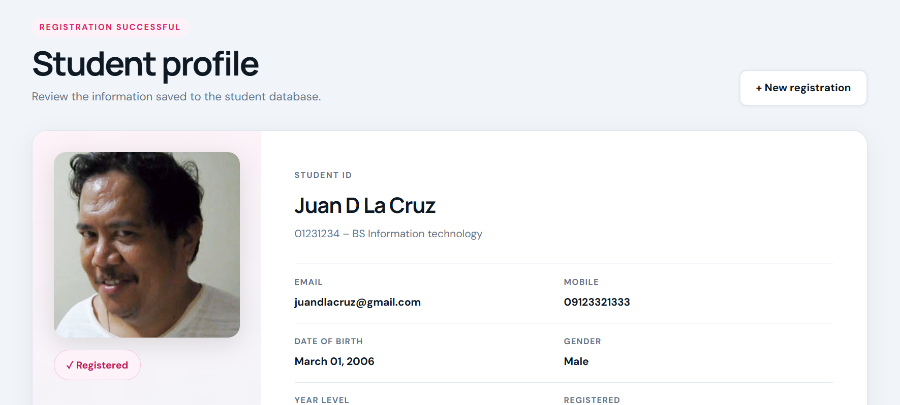

### Database Records

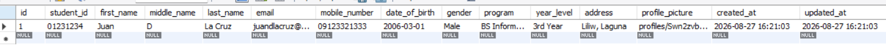

### Student Profile

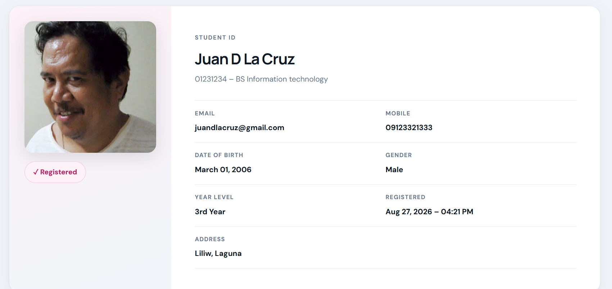

### VS Code Project Structure

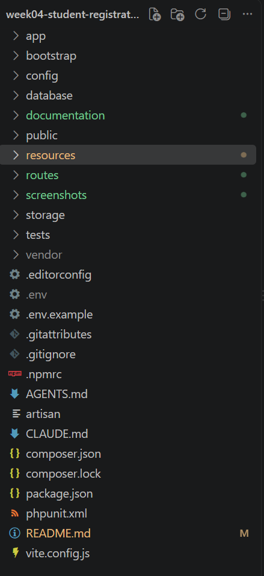

### GitHub Repository

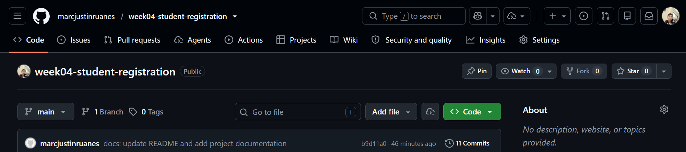

### Terminal Output

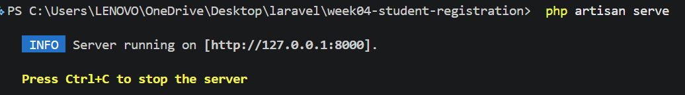

### Browser Output

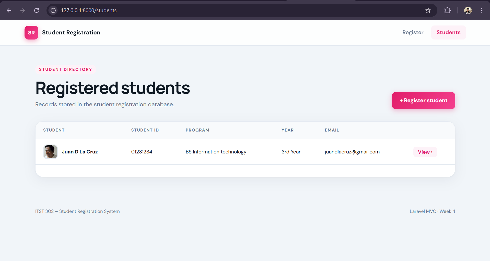

---

## 12. Problems Encountered

### Problem 1 — Database Connection Error

One of the problems encountered during development was an error when connecting the Laravel application to the MySQL database.

The application could not connect properly because the database configuration was not correct.

**Solution**

I checked the database configuration in the `.env` file. I made sure that the database name, username, password, host, and port matched my MySQL configuration.

After correcting the database settings, I tested the connection again and ran:

```bash
php artisan migrate
```

The Laravel application was then able to connect to MySQL and create the required tables.

### Problem 2 — Error with the Registration Time

Another problem happened with the time shown during the registration process.

The registration time was not showing the expected local time. This caused confusion when checking the time stored in the database.

**Solution**

I checked the timezone settings of the Laravel application and made sure that the correct timezone was being used.

I then tested the registration process again and checked the saved record in the database.

After correcting the timezone setting, the registration time was displayed correctly.

### Problem 3 — Forgot MySQL Database Password

During development, I forgot the password for my MySQL database account. Because of this, Laravel could not connect to MySQL using the database credentials in the `.env` file.

**Solution**

I reset the MySQL database password and updated the password in the Laravel `.env` file.

After updating the database credentials, I tested the connection again and successfully ran the Laravel migration.

This experience also reminded me to keep important database credentials secure and properly managed during development.

---

## 13. Solutions Summary

| Problem | Solution |
|---|---|
| Database connection error | Checked and corrected the database settings in `.env` |
| Incorrect registration time | Checked and corrected the Laravel timezone setting |
| Forgot MySQL password | Reset the MySQL password and updated the `.env` file |

---

## 14. Reflection

Building the Student Registration System helped me understand how a web application receives information from a user and processes it. Before this activity, I knew that forms were used to collect information, but I did not fully understand what happens after a user clicks the submit button. Through this project, I learned how Laravel receives a request, checks the information, saves it to the database, and shows the result to the user.

One of the most important things I learned is the importance of validation. Users can enter incomplete or incorrect information, so the system needs to check the data before saving it. For example, the Student ID and email should be unique. The email should also have a valid format. The profile picture should be an image and should not be too large. These checks help keep the database clean and prevent incorrect information from being stored.

I also learned why server-side validation is important. Client-side validation can give users quick feedback, but it should not be trusted by itself. A user can change or remove client-side rules using browser developer tools. Server-side validation happens on the server, so the application can check the information before saving it. Because of this, server-side validation gives better protection for the database. Using both client-side and server-side validation gives users a better experience while also protecting the application.

Handling file uploads was another important lesson. I learned that an uploaded profile picture should be handled carefully. Laravel Storage provides a proper way to store uploaded files. I also learned how `php artisan storage:link` allows files stored in the storage folder to be displayed through the application.

During development, I experienced several problems. I had errors when connecting Laravel to the database, an issue with the registration time, and I also forgot my MySQL database password. Solving these problems taught me that debugging is an important part of programming. Developers need to read error messages, check configuration files, test their code, and try different solutions until the problem is fixed.

This project also helped me understand how registration systems are used in real organizations. Schools can use registration systems to collect student information. Companies can use similar systems for employee registration. The information collected can later be used by other systems such as enrollment, grading, library management, payroll, and record management.

Overall, this activity improved my understanding of Laravel forms, validation, file uploads, databases, and request handling. I learned that creating an application is not only about making the page work. It is also important to check user input, protect information, store data correctly, and give clear feedback to users. These skills will be useful in future Laravel projects and other web applications.

---

## 15. References

- Laravel. (n.d.). *Laravel documentation*. https://laravel.com/docs
- MDN Web Docs. (n.d.). *MDN Web Docs*. https://developer.mozilla.org/
- Oracle. (n.d.). *MySQL documentation*. https://dev.mysql.com/doc/
- OWASP Foundation. (n.d.). *OWASP Top 10*. https://owasp.org/www-project-top-ten/
- PHP Documentation Group. (n.d.). *PHP manual*. https://www.php.net/manual/en/
- Tailwind Labs. (n.d.). *Tailwind CSS documentation*. https://tailwindcss.com/docs
